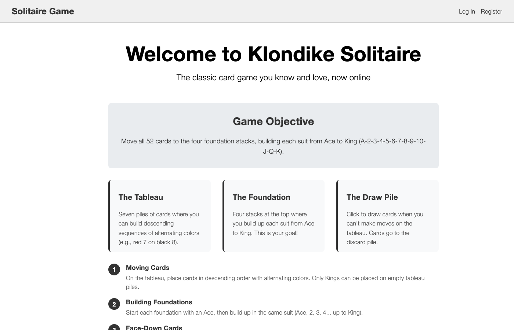
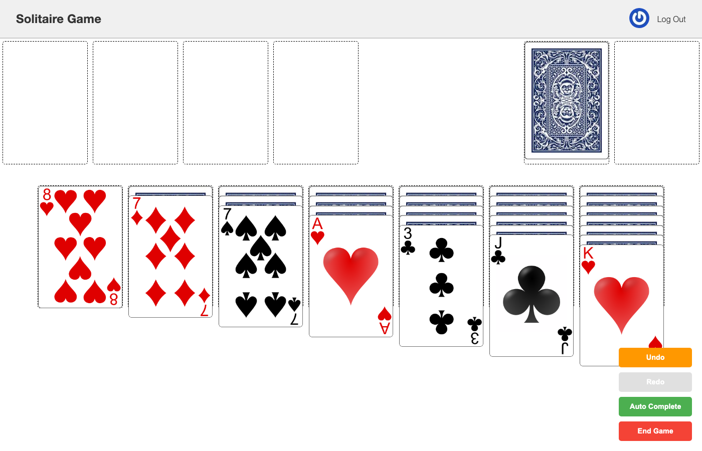

# Klondike Solitaire

A full-stack, multi-variant solitaire game with an authoritative server. Every move is
validated server-side and persisted as a document with before/after state, which gives
unbounded undo and move-by-move replay for free.





## Tech stack

- **Client:** React 19, React Router, styled-components, bundled with Webpack 5 and Babel
- **Server:** Node.js, Express 5, express-session
- **Database:** MongoDB via Mongoose 8
- **Auth:** Username/password, plus optional "Sign in with GitHub" OAuth

The original deployment ran on **AWS behind an nginx reverse proxy** with PM2 and SSL.
That infrastructure isn't part of this repo, so the instructions below run everything
locally instead — no AWS or nginx required.

## Running it locally

### Prerequisites

- [Node.js](https://nodejs.org/) (v20+ recommended)
- [Docker](https://www.docker.com/) (the easiest way to get a local MongoDB, no native
  install needed)

### 1. Start MongoDB

The app expects MongoDB on port `55000` (see `config/config.json`). Spin one up with
Docker:

```bash
docker run -d --name klondike-mongo -p 55000:27017 mongo:7
```

### 2. Install dependencies and build the client

```bash
npm install
npm run build
```

### 3. Start the server

```bash
npm run start
```

The server listens on **http://localhost:8080**. Open it in a browser and you're ready
to play.

> **Optional: GitHub OAuth login.** Regular username/password registration and login
> work with zero extra setup. If you also want the "Login with GitHub" button to work,
> set these three environment variables before starting the server, using a
> [GitHub OAuth App](https://github.com/settings/developers) you register yourself:
>
> ```bash
> export GITHUB_CLIENT_ID=your_client_id
> export GITHUB_CLIENT_SECRET=your_client_secret
> export GITHUB_CALLBACK_URL=http://localhost:8080/v1/auth/github/callback
> ```
>
> Without these set, the server logs a warning on startup and simply skips that one
> login path — everything else works normally.

## How to play

1. **Register an account** from the homepage, or **log in** if you already have one.
2. From your profile page, click **Start New Game**.
3. Pick a variant (klondike, pyramid, canfield, golf, yukon, or hearts), a draw mode
   (Draw 1 or Draw 3), and a card color, then click **Start**.
4. Play the board:
   - Build the seven **tableau** piles in descending order, alternating colors (e.g.
     red 7 on black 8). Only a King can start an empty tableau pile.
   - Build the four **foundation** piles up by suit, starting from the Ace.
   - Click the **draw pile** to flip new cards when you're stuck.
   - Moving a card off a tableau pile flips the card beneath it face-up.
5. Use **Undo** / **Redo** to step back and forth through your move history, or
   **Auto Complete** once the rest of the game can finish itself.
6. **End Game** to finish the session; your games and their status are listed on your
   profile page afterward.

## Running tests

```bash
npm run test
```

This runs against a separate `testing` database (see `config/config.json`), so it won't
touch data from a game you're actively playing.
